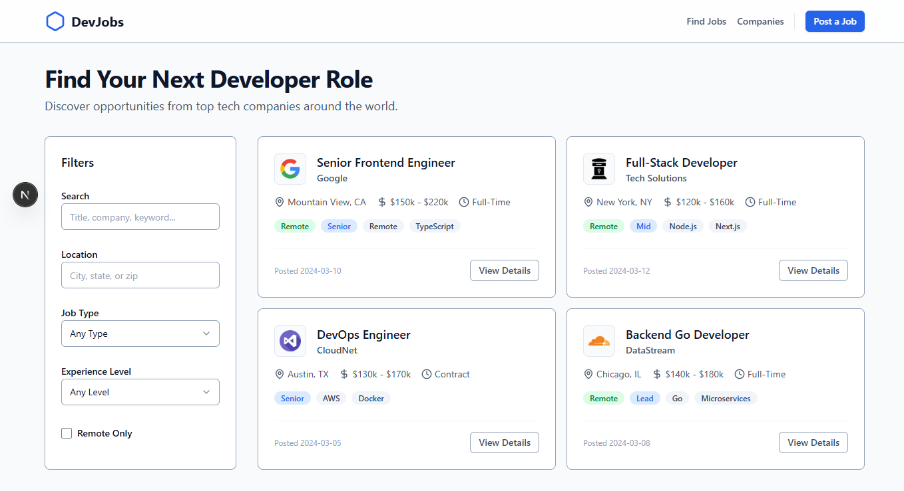

# Project Nexus: Interactive Job Board Platform

A modern, responsive job board application built with Next.js 15, featuring advanced filtering capabilities, simulated async data fetching, and a strict Atomic Design architecture.

🔗 **Live Demo:** [DevJobs](https://alx-project-nexus-ebon.vercel.app/)



## 📋 Table of Contents

- [About ProDev Frontend Engineering Program](#about-prodev-frontend-engineering-program)
- [Project Overview](#project-overview)
- [Features](#features)
- [Technologies Used](#technologies-used)
- [Architecture & Design](#architecture--design)
- [Major Learnings](#major-learnings)
- [Challenges & Solutions](#challenges--solutions)
- [Setup Instructions](#setup-instructions)
- [Project Structure](#project-structure)
- [Future Enhancements](#future-enhancements)

---

## 🎓 About ProDev Frontend Engineering Program

The ProDev Frontend Engineering program is a comprehensive training initiative focused on building production-ready applications using modern frontend technologies. This job board platform represents the culmination of skills acquired throughout the program, demonstrating proficiency in building scalable, accessible, and user-centric applications.

---

## 📖 Project Overview

**Project Nexus** is an Interactive Job Board that enables users to discover, filter, and apply for job opportunities. Unlike simple tutorials, this project simulates a real-world environment with network latency, loading states, error handling, and robust form validation.

### Key Objectives:
- **Simulated Backend:** A custom service layer that mimics REST API latency and random server errors.
- **Advanced Filtering:** High-performance client-side filtering using `useMemo`.
- **Atomic Design:** A strict component hierarchy (Atoms → Molecules → Organisms).
- **Zero-Config Styling:** Utilizing the new **Tailwind CSS v4** engine.

---

## ✨ Features

### 🔍 Job Search & Discovery
- **Simulated Async Data:** Fetches job listings with realistic network delay skeletons.
- **Dynamic Details Page:** Routing to `/jobs/[id]` to view specific job data.
- **Visual Feedback:** Dedicated Loading, Empty, and Error states (404/500).

### 🎯 Advanced Filtering
- **Search:** Real-time text search by title or company.
- **Location Filter:** Filter by specific cities.
- **Job Type & Experience:** Dropdown filters for Seniority and Contract type.
- **Remote Toggle:** Boolean filter for remote-only roles.
- **Clear All:** One-click reset for the entire filter state.

### 📱 Responsive Design
- **Adaptive Grid:** 1 column (mobile) to 3 columns (desktop).
- **Mobile Sidebar:** Filters move to a collapsible/stackable layout on smaller screens.
- **Touch-optimized:** Large touch targets for buttons and inputs.

### 📝 Application System
- **Multi-step Flow:** Dedicated `/apply` route.
- **Custom File Upload:** Drag-and-drop UI implementation.
- **Form Validation:** Client-side validation for Name, Email, and Resume.
- **Success/Error Feedback:** simulated server response handling.

---

## 🛠 Technologies Used

### Core Framework
- **Next.js 15** (Pages Router)
- **React 18**
- **TypeScript** (Strict Interfaces)

### Styling & UI
- **Tailwind CSS v4** - Utilizes CSS variables for theming (No `tailwind.config.js`).
- **Lucide React** - Consistent icon set.
- **Clsx / Tailwind-merge** - For dynamic class composition.

### State Management
- **React Context API** - `JobContext` for global job data and filter state.
- **Custom Hooks** - `useJobs` for consuming data.

---

## 🏗 Architecture & Design


[Image of Atomic Design methodology diagram]


This project follows **Atomic Design** principles to ensure component reusability and scalability. We organized the codebase into a flat root structure (No `src` directory) to keep imports clean.

- **Atoms:** Basic building blocks (`Button`, `Badge`, `Input`, `Select`).
- **Molecules:** Groups of atoms (`JobCard`, `FileUpload`, `SearchBar`).
- **Organisms:** Complex sections (`FilterSidebar`, `JobGrid`, `Navbar`).
- **Templates:** Page layouts (`MainLayout`).

---

## 📚 Major Learnings

### 1. Tailwind CSS v4 Migration
Moved away from the traditional `tailwind.config.js`. Learned to configure the design system directly in CSS using native variables:
```css
@theme {
  --color-primary: #2563EB;
  --font-sans: var(--font-inter), ui-sans-serif;
}
````

### 2\. The "Simulated Async" Pattern

Instead of hardcoding data directly into components, I built a `lib/api.ts` service layer. This allowed me to develop "Loading" and "Error" UI states without needing a real backend server yet.

### 3\. Performance with `useMemo`

To ensure the search filter remains snappy even with many jobs, I implemented memoization:

```typescript
const filteredJobs = useMemo(() => {
  return jobs.filter((job) => {
    // Complex matching logic for Location, Type, Remote, etc.
  });
}, [jobs, filters]);
```

-----

## 🚧 Challenges & Solutions

### Challenge 1: Handling Global Filter State

**Problem:** Passing filter props down from the Page to the Sidebar and then back up to the Grid caused "Prop Drilling."

**Solution:** I implemented a `JobContext`. This allows the `FilterSidebar` to write to the state and the `JobGrid` to read from it, completely decoupled from each other.

### Challenge 2: Dynamic Routing & Fallbacks

**Problem:** Handling users navigating to a job ID that doesn't exist.
**Solution:** Implemented a check in `pages/jobs/[id].tsx`. If `api.fetchJobById` returns null, we conditionally render a "Job Not Found" UI or redirect to a custom 404 page.

-----

## 🚀 Setup Instructions

### Prerequisites

  - Node.js 18+ installed.

### Installation

1.  **Clone the repository:**

<!-- end list -->

```bash
git clone https://github.com/Marvie-03/alx-project-nexus.git
cd project-nexus
```

2.  **Install dependencies:**


```bash
npm install
```

3.  **Run the development server:**


```bash
npm run dev
```

4.  **Open your browser:**
    Navigate to [http://localhost:3000](https://www.google.com/search?q=http://localhost:3000)

-----

## 📁 Project Structure

We utilize a **Root-level** structure for simplicity and cleaner imports (`@/components/...`).

```text
project-nexus/
├── components/
│   ├── atoms/       (Button.tsx, Badge.tsx...)
│   ├── molecules/   (JobCard.tsx, FileUpload.tsx...)
│   ├── organisms/   (JobGrid.tsx, FilterSidebar.tsx...)
│   └── templates/   (MainLayout.tsx)
├── context/         (JobContext.tsx)
├── hooks/           (useJobs.ts)
├── interfaces/      (job.ts, filter.ts)
├── lib/             (api.ts, data.ts, utils.ts)
├── pages/
│   ├── index.tsx
│   ├── 404.tsx
│   └── jobs/
│       ├── [id].tsx
│       └── [id]/apply.tsx
├── styles/          (globals.css - Tailwind v4 config)
└── public/          (Assets)
```

-----

## 🔮 Future Enhancements

  - [ ] **Dark Mode:** Easy implementation via Tailwind v4 CSS variables.
  - [ ] **Persistence:** Save "Applied Jobs" to `localStorage`.
  - [ ] **Real Backend:** Replace `lib/data.ts` with a real Supabase or Firebase fetch.
  - [ ] **Admin Dashboard:** A route to post new jobs.

-----

## 👤 Author

**Marvellous Modupe**
ProDev Frontend Engineering Cohort 3 [2025]

  - GitHub: [@Marvie-03](https://github.com/Marvie-03)
  - LinkedIn: [Modupe Marvellous](https://linkedin.com/in/kayveengee)
  - Portfolio: [My Portfolio](https://portfolio-marvel.netlify.app)

-----

**Built with ❤️ as part of the ALX ProDev Frontend Engineering Program**

